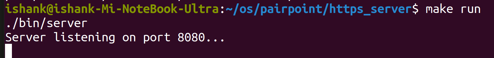
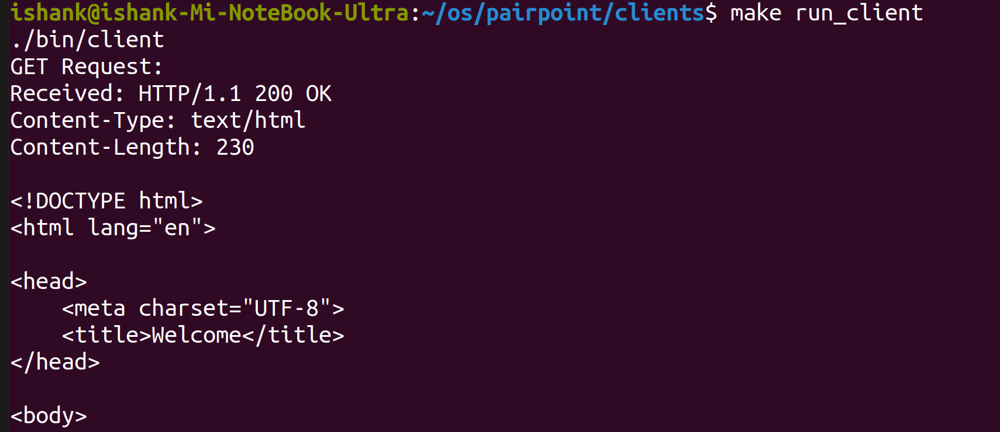

## Multi-threaded Web Server Project

### Table of Contents
- [Overview](#overview)
- [Features](#features)
- [Project Structure](#project-structure)
- [Technologies Used](#technologies-used)
- [Getting Started](#getting-started)
  - [Prerequisites](#prerequisites)
  - [Installation](#installation)
  - [Running the Server](#running-the-server)
- [HTTP Methods](#http-methods)
  - [GET Method](#get-method)
  - [POST Method](#post-method)
  - [PUT Method](#put-method)
  - [DELETE Method](#delete-method)
  - [Error Handling](#error-handling)
- [Concurrency](#concurrency)
  - [Thread Pooling](#thread-pooling)
- [Authentication and Security](#authentication-and-security)
  - [Password Protection](#password-protection)
- [Client Testing](#client-testing)
  - [Single Client (C)](#single-client-c)
  - [Single Client (Python)](#single-client-python)
  - [Multi-Client Simulation](#multi-client-simulation)
- [Log File](#log-file)
- [Screenshots](#screenshots)
- [Acknowledgements](#acknowledgements)

---

## Overview

This project implements a **multi-threaded web server** capable of handling multiple client connections concurrently. The server supports key HTTP methods (`GET`, `POST`, `PUT`, `DELETE`), employs **thread pooling** for efficient connection handling, and includes **basic password protection** for sensitive operations.

---

## Features

- **Multi-threading with Thread Pooling:** Efficiently handles multiple client requests using a fixed-size thread pool.
- **Static File Hosting:** Serves static files (HTML, CSS, etc.) from the `static/` directory.
- **HTTP Method Support:** Supports `GET`, `POST`, `PUT`, `DELETE` requests.
- **Password Protection:** Secures specific endpoints with a basic password mechanism.
- **Request Logging:** Logs all incoming requests to `server_log.txt`.
- **Error Handling:** Returns appropriate error codes for invalid requests.
- **Scalability:** Handles multiple clients concurrently without performance degradation.

---

## Project Structure

```plaintext
project-root/                        # Project root directory
├── clients/                         # Client simulation scripts
│   ├── client.c                     # C source for a single client program
│   ├── client.py                    # Python script for simulating a single client
│   ├── Makefile                     # Build configuration file for client programs
│   ├── multi_client.c               # C source for a multi-client handling program
│   └── multi_client.py              # Python script for simulating multiple clients
│
├── https_server/                    # HTTPS server implementation
│   ├── include/                     # Directory containing header files for the server
│   │   ├── auth.h                   # Header file for authentication functions
│   │   ├── config.h                 # Header file for configuration handling
│   │   ├── http.h                   # Header file for HTTP request and response handling
│   │   ├── logger.h                 # Header file for logging utilities
│   │   ├── queue.h                  # Header file for queue data structure and operations
│   │   └── server.h                 # Header file for core server definitions and functions
│   │
│   ├── Makefile                     # Build configuration file for the HTTPS server
│   ├── server.conf                  # Server configuration file (e.g., port settings, thread pool size)
│   ├── server_log.txt               # Log file where server events and errors are recorded
│   │
│   ├── src/                         # Directory containing source files for the server
│   │   ├── auth.c                   # Source file for authentication logic
│   │   ├── config.c                 # Source file for configuration management logic
│   │   ├── http.c                   # Source file for handling HTTP requests and responses
│   │   ├── logger.c                 # Source file for logging functionality
│   │   ├── main.c                   # Main server code, entry point of the server program
│   │   ├── queue.c                  # Source file for queue management operations
│   │   └── server.c                 # Core server logic and functionality
│   │
│   └── static/                      # Directory containing static files served by the server
│       ├── index.html               # Default HTML page served at the root URL
│       ├── post_test.html           # HTML page for testing POST requests
│       └── put_file.txt             # Sample file for testing PUT requests
│
├── assets/                          # Directory for project assets such as screenshots or diagrams
│   ├── server_output.png            # Screenshot showing server output or logs
│   └── client_demo.png              # Screenshot of client interaction or demo in action
│
├── README.md                        # Project documentation file with setup and usage instructions
│
└── test/                            # Testing utilities and scripts
    └── base64-encoding.py           # Python script for testing base64 encoding functionality
```

---

## Technologies Used

- **Programming Language:** C (Server)
- **Thread Management:** POSIX Threads (pthreads)
- **Client-Side Testing:** Python 3 (`socket` library) and C (for single-client and multi-client testing)
- **HTTP Protocol Handling**
- **Password Management:** Secure password verification using hashing.

---

## Getting Started

### Prerequisites

- GCC (GNU Compiler Collection)
- Python 3.x
- Basic understanding of HTTP methods, multi-threading, and authentication.

### Installation

1. Clone the repository:
   ```bash
   git clone git@github.com:ishankkumar-007/web-server-in-C.git
   ```

2. Compile the server:
   ```bash
   gcc server.c -o server
   ```

3. Compile the client:
   ```bash
   gcc client.c -o client   # For the C client
   ```

4. Place your test files in the `static/` directory.

### Running the Server

1. Start the server:
   ```bash
   ./server
   ```

---

## HTTP Methods

### GET Method

- **Purpose:** Fetch static files from the `static/` directory.
- **How It Works:**  
  1. Parses the requested file path from the client’s HTTP request.  
  2. Searches for the file in the `static/` directory.  
  3. If the file exists, it sends a `200 OK` response with the file content.  
  4. If not, it sends a `404 Not Found` response.

### POST Method

- **Purpose:** Receive data from the client.
- **How It Works:**  
  1. Parses the request body to extract data sent by the client.  
  2. Processes the data (e.g., logs or writes to a file).  
  3. Sends a `200 OK` or `201 Created` response to confirm receipt.

### PUT Method

- **Purpose:** Upload or update files on the server.
- **How It Works:**  
  1. Extracts the file name and content from the HTTP request.  
  2. Writes the content to a file in the `static/` directory.  
  3. Sends `201 Created` (new file) or `200 OK` (updated file) based on the operation.

### DELETE Method

- **Purpose:** Remove files from the server's `static/` directory.  
- **How It Works:**  
  1. The client sends an HTTP request specifying the file to delete.  
  2. The server locates the file in the `static/` directory.  
  3. If the file exists:  
      - Deletes the file.  
      - Sends a `200 OK` response to confirm the deletion.  
  4. If the file does not exist, the server responds with `File Not Found`.  
  5. If the client does not have appropriate permissions (e.g., missing password), the server sends a `401 Unauthorized Authentication required` response.  


- **Server Response Codes:**  
  - `200 OK`: File successfully deleted.  
  - `404 Not Found`: File does not exist.  
  - `401 Unauthorized`: Password required or incorrect.  
  - `405 Method Not Allowed`: DELETE method is disabled or unsupported for the requested resource.

### Error Handling

- **Unsupported Methods:** Sends `405 Method Not Allowed`.  
- **File Not Found (GET):** Returns `404 Not Found`.

---

## Concurrency

### Thread Pooling

- **Purpose:** Efficiently manage server resources and handle multiple clients concurrently without creating excessive threads.  
- **Implementation:**  
  1. The server initializes a fixed-size thread pool at startup.  
  2. Incoming client requests are placed in a task queue.  
  3. Worker threads from the pool pick up tasks from the queue and process them.  
  4. Once a thread finishes handling a client, it waits for the next task in the queue.  
- **Advantages:**  
  - Reduces thread creation overhead.  
  - Ensures stable performance under heavy load.  
  - Prevents server crashes due to unbounded thread creation.

---

## Authentication and Security

### Password Protection

- **Purpose:** Secure sensitive endpoints (e.g., file upload via PUT).  
- **How It Works:**  
  1. The client includes a password in the HTTP header for sensitive requests.  
  2. The server verifies the password against a stored hash.  
  3. If the password is correct, the request proceeds; otherwise, the server returns a `401 Unauthorized` response.  
- **Configuration:** The password is hardcoded in the server for simplicity.

---

## How to Run the Server

### **Configure the Server**
1. Edit the `server.conf` file to set up server parameters such as port number, thread pool size, etc. Example:
   ```plaintext
   port=8080
   document_root=./static
   thread_pool_size=10
   buffer_size=1024
   log_file=server_log.txt

### **Build the Server**
1. Navigate to the `https_server` directory:
   ```bash
   cd https_server
   ```
2. Compile the server using `Makefile`:
   ```bash
   make
   ```
   

### **Run the Server**
   ```bash
   make run
   ```

---

## Client Testing 

### **Single Client Testing (C Program)**

1. **Build the Client:**
   - Navigate to the `clients` directory:
     ```bash
     cd clients
     ```
   - Compile the client:
     ```bash
     make
     ```

2. **Run the Client:**
   ```bash
   make run_client
   ```

---

### **Multi-Client Testing (C Program)**

1. **Build the Multi-Client Program:**
   ```bash
   make
   ```

2. **Run Multiple Clients Simultaneously:**
   ```bash
   make run_multi_client
   ```

---

### **Python Client Testing**

#### **Single Client (Python)**
1. Ensure you have Python 3 installed.
2. Run the `client.py` script:
   ```bash
   python3 client.py
   ```

<!-- #### **Multi-Client (Python)**
1. Run the `multi_client.py` script to simulate multiple clients:
   ```bash
   python3 multi_client.py
   ``` -->

---

### **Testing Notes**
- **Logs:** Server logs are saved in `https_server/server_log.txt` for debugging.
- **Configuration:** Adjust configurations in `server.conf` before testing.
- **Static Files:** Default static files (like `index.html`) are served from the `https_server/static` directory. Modify or add files as needed.

---

## Log File

The server logs all incoming requests and actions to `server_log.txt`. You can check this file for debugging purposes and to track server activity.

---

## Screenshots

1. **Server Running**  

    

2. **Client Requests**  

   

---

